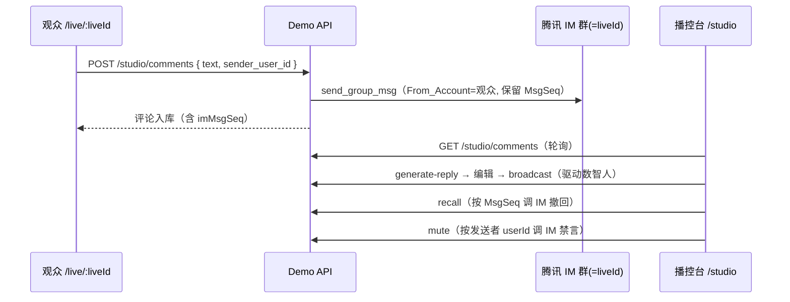

# IM 评论链路 · 撤回 / 禁言 / 多管理员协作

本文档说明评论如何**真走腾讯 IM**，以及播控台的撤回、禁言、多管理员协作锁与演示种子评论。

## 一、评论链路

- 直播间的 **IM 群 ID = `liveId`**（与 TUILiveKit `create_room` 的 RoomId 对齐）。
- 观众发评论时服务端以管理员身份 `send_group_msg`，用 `From_Account` 保留观众身份，并记录返回的 **`MsgSeq`**（撤回所需）。
- 观众端公开评论流来自 `GET /api/rooms/:id/comments/public`（过滤已撤回）。

## 二、撤回

`POST /api/rooms/:id/studio/comments/:cid/recall`：

- 若评论有 `imMsgSeq` 且 IM 已配置 → 调 `group_open_http_svc/group_msg_recall` 真撤回。
- 同时本地标记 `recalled`，观众端公开流不再展示。
- 文档：[撤回群消息](https://cloud.tencent.com/document/product/269/12341)。

## 三、禁言

`POST /api/rooms/:id/studio/comments/:cid/mute { seconds }`（默认 `STUDIO_MUTE_SECONDS`=600）：

- 调 `group_open_http_svc/forbid_send_msg` 对该评论发送者禁言；`seconds=0` 解禁，`4294967295` 永久。
- 文档：[批量禁言](https://cloud.tencent.com/document/product/269/1627)。

## 四、模型回复 → 编辑 → 播报

1. **模型回复** `generate-reply`：调 `server/llmReply.mjs`（配 `LLM_*` 走真实 LLM，否则占位话术）。
2. 中间编辑框二次加工（`PATCH .../comments/:cid` 保存草稿）。
3. **播报** `broadcast`：把最终文案经数智人 aPaaS `SEND_TEXT` 驱动播报；观众与监控可见数智人开口。

## 五、多管理员协作

- 管理台为每个房间生成 **管理员 A / B** 两个链接：`/studio/:roomId?mod=a`、`?mod=b`，分别对应 IM 身份 `mod_a_*` / `mod_b_*`（`token` 接口 `slot=a|b`）。发给可信运营人员即可，无需口令。
- **认领锁定**：`POST .../comments/:cid/claim { mod }`。点「模型回复」会自动认领；其他管理员看到「X 处理中」徽标，重复认领会 409，避免两人对同一条评论同时回复。释放：`claim { mod, release:true }`。
- 锁状态保存在服务端内存，随房间生命周期存在；解散房间即清理。

## 六、演示种子评论

每个房间首次进入播控台会自动注入一组**政策宣讲**场景的种子评论（见 `server/studio.mjs` 的 `SEED_COMMENTS`），便于一进房即可演示。可直接编辑该常量替换为你的话术。

## 七、配置要求

- App 管理员账号：`IM_REST_ADMIN_USER_ID`（或 `TUILIVE_REST_ADMIN_USER_ID`）。
- IM 与 TRTC 同一 `SDKAppID`，`TRTC_SECRET_KEY` 同时用于 IM REST 签名。
- 未配置 IM 时：评论仍可本地演示，撤回/禁言降级为本地标记（接口 `im.reason=im_not_configured`）。
