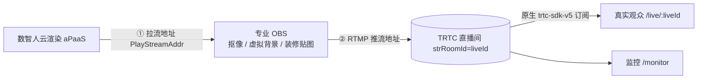

# OBS 拉流转推管线（生产标准）

本文档说明数字人直播如何按「**拉流 → 处理 → 推流**」的生产标准接入专业 OBS，与真人直播（摄像头 → OBS 抠像/装修 → RTMP 推流 → 直播间）保持一致的拓扑。

## 一、拓扑



- 数智人**不直接进 TRTC 直播间**；它通过 `rtmp` 协议产出一路可拉取的播放流。
- OBS 是「软件导播台」：拉数智人画面，做抠像 / 虚拟背景 / 装修贴图后，作为机器人/主播身份把合成画面推回 TRTC 直播间。
- 观众端、监控页用同一字符串房间号 `liveId` 进房订阅，即可看到合成后的画面。

## 二、两个地址怎么来

播控台点「开始直播（生产模式）」后，服务端 `POST /api/rooms/:id/studio/start { mode:'production' }` 返回 `obs` 端点（也可 `GET /api/rooms/:id/studio/obs-endpoints` 获取）：

### ① 拉流地址（OBS 媒体源输入）

数智人 `rtmp` 协议会话产出的 `PlayStreamAddr`，形如：

```
rtmp://liveplay.ivh.qq.com/live/m789
```

服务端同时给出 FLV/HLS 变体（`https://.../live/m789.flv`、`.m3u8`），供网页播放器或 OBS「媒体源」拉取。
参考：[数智人新建直播流会话](https://cloud.tencent.com/document/product/1240/100388)。

### ② 推流地址（OBS 推流输出，推回直播间）

把合成画面以 RTMP 推回 TRTC 直播间，机器人/主播 userId 固定为 `obs_robot_{liveId}`：

```
rtmp://rtmp.rtc.qq.com/push/{liveId}?sdkappid={SDKAppID}&userid={obs_robot_*}&usersig={UserSig}
```

- 主域名 `rtmp.rtc.qq.com`，备用域名 `rtmp.cloud-rtc.com`（主域名解析异常时使用）。
- `liveId` 是字符串房间号（≤64，数字/字母/下划线），本项目房间号天然满足。
- 需在 **TRTC 控制台 → 应用 → 功能配置 → 输入媒体流进房** 开启该能力。
- 参考：[实时音视频 · 输入媒体流进房](https://cloud.tencent.com/document/product/647/102957)。

> 约束：观看端必须用**相同字符串房间号**进房才能看到该路 RTMP 流。本项目所有端进房都用 `strRoomId = liveId`，已满足。

## 三、OBS 操作步骤

1. **添加媒体源**：来源 → 媒体源 → 取消「本地文件」→ 输入①拉流地址（FLV/RTMP）。
2. **抠像 / 虚拟背景**：给媒体源加「色度键（绿幕）」滤镜（数智人可输出透明/绿幕背景）；在其下方叠加虚拟背景图层。
3. **装修贴图**：叠加图片源（Logo、下沿标题条、活动贴图等）。
4. **设置推流**：设置 → 推流 → 服务「自定义」→ 服务器填 `rtmp://rtmp.rtc.qq.com/push/`，串流密钥填 `{liveId}?sdkappid=...&userid=...&usersig=...`（即②去掉前缀）。
5. **开始推流**：观众端 `/live/:liveId` 即可看到合成画面。

## 四、直连模式（无需 OBS，快速验证）

`POST /api/rooms/:id/studio/start { mode:'direct' }`：数智人以 `trtc` 协议**直接进** TRTC 直播间推流，播控台 / 观众端直接订阅。用于快速验证数智人说话链路，不做抠像/装修。

## 五、延迟与并发

- 拉流 → OBS 合成 → 再推流 → 观众，会叠加约数百 ms ~ 1s 延迟；人工筛选评论后播报的场景可接受。
- 生产模式占用 1 路数智人并发 + 1 路 RTMP 入流；direct 模式占用 1 路数智人 TRTC 进房。

## 六、未配置密钥时的降级

- 未配置 `IVH_*`：start 返回 `placeholder:true`，不产生真实流，地址字段为占位。
- 未配置 `TRTC_SECRET_KEY`：推流地址签名失败，端点 `pushSignError` 字段给出原因（其余流程不阻塞）。
