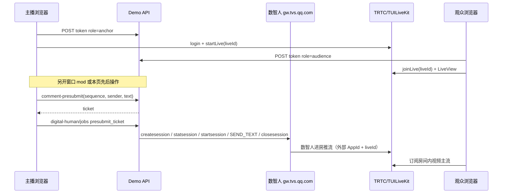

# TRTC 直播 × 腾讯云智能数智人（云渲染）— 集成路线图

本文档与代码迭代同步，描述「**TRTC 房间内唯一视频源为数字人**」目标下的分步改造计划。采购项已具备的前提下，优先采用 **HTTP 一句话文本驱动** 以降低前期复杂度；延迟目标 **秒级～数分钟可接受**（人工筛选评论后触发）。

官方概念参考：[会话交互接入方案概述](https://cloud.tencent.com/document/product/1240/117952)、[云渲染会话交互服务 API 概述](https://cloud.tencent.com/document/product/1240/100385)。

---

## 一、关于「先拿推流地址再录到数智人」的澄清（需在阶段二与控制台对齐）

常见两种集成形态（以最新控制台与 API 为准，实施前需做一次对照验证）：

1. **数智人产出可播流**：调用云渲染 **创建会话** 等接口后，拿到**数智人侧**的播放/拉流地址（或 TRTC 相关入参，如文档中的 `gettrtcsign` 等），再将该路流作为观众看到的「主播画面」。
2. **你方已有 TRTC 直播间（TUILiveKit `liveId`）**：需要明确「**由谁向该房间发布视频**」——是数智人云端直接进 TRTC、还是你方媒体服务拉数智人流再转推 TRTC。二者密钥、角色与计费不同，**不能仅凭直觉假设「把己方推流 URL 填给数智人」即可完成双向对接**。

阶段二的产出物之一：**用一页纸序列图**写清「创建会话 → 流就绪 → 开启会话 → HTTP 驱动 → 观众 LiveView 看到的流」与 `liveId` 的对应关系。

---

## 二、分阶段计划（与仓库迭代对应）

### 阶段一（当前提交）：去掉默认 Canvas，主路径让位给 TRTC + 数智人

- **主播默认页** `/anchor/:roomId` 更名为「主播控制台」：**不再挂载** `minimal-live-broadcast.html` 隐藏 iframe，不再依赖 Canvas 自定义视频轨作为默认开播手段。
- **遗留调试**：Canvas 方案迁至 **`/anchor-canvas/:roomId`**，仅供与旧实验对比，不参与正式数字人链路。
- **保留**：评论管理（`mod_*` + `joinLive` + IM 弹幕列表）与「数字人任务」占位 API（后续替换为真实数智人 HTTP 调用）。

### 阶段二（当前提交）：服务端对接数智人云渲染（HTTP 一句话驱动）

- **`server/ivhApaas.mjs`**：按 [aPaaS 接口调用方式](https://cloud.tencent.com/document/product/1240/107197) 生成 `appkey` + `timestamp` 的 HMAC-SHA256 签名，对 `https://gw.tvs.qq.com` 发起 `createsession` / `statsession` / `startsession` / `command`（`SEND_TEXT`）/ `closesession`。
- **`server/ivhPipeline.mjs`**：在 `POST /api/rooms/:id/digital-human/jobs` 入队后 **异步** 执行「创建会话 → 轮询至 SessionStatus=1 → 必要时开启会话 → 文本驱动 → 关闭会话」；任务对象中写入 `ivhSessionId`、`ivhPlayStreamAddr`（若有）、`ivhVirtualmanUserId` 等。
- **未配置 `IVH_*`** 时仍走占位图逻辑，便于本地无密钥调试。
- **TRTC 对接形态**：创建会话采用 **外部 TRTC AppId + `TrtcStrRoomId` = 直播间 `liveId`**，并为数智人单独签发 `UserSig`（`UserId` 默认 `vh_{liveId 片段}_{job 后缀}`，可通过 `IVH_TRTC_USER_ID` 覆盖前缀），与主播 `anchor_*`、管理员 `mod_*` 区分。

### 阶段三（当前提交）：观众端消费「房间内主流」— 先保证直播会话存在

- **根因**：`liveId` 若未在 TUILiveKit 侧通过 `startLive` 创建为「直播」，观众 `joinLive` 与数智人进房可能无法对齐同一业务会话。
- **主播控制台** `/anchor/:roomId` 增加 **「以主播身份开启直播」**：`anchor_*` 登录后调用 `startLive({ liveId, liveName })`；**「结束直播」** 调用 `endLive`。
- **约束（机制）**：`useLoginState` 为单例，**同一标签页不能同时持有主播与 mod 两套身份**；需要「直播进行中 + mod 审评论」时，请 **另开浏览器窗口** 再打开本页仅连接 `mod_*`（文档与页面内提示已写清）。
- 观众端仍为官方 `LiveView`；Canvas 不作为默认路径（见阶段一）。

### 阶段四（当前提交）：评论进入数智人任务的「权威文本」路径

- **`POST /api/rooms/:id/digital-human/comment-presubmit`**：body 携带 IM 消息的 `sequence`、`timestamp_in_second`、`sender_user_id`、`text`，服务端生成 **一次性** `ticket`（内存、默认 15 分钟有效）并返回规范 `comment_id`。
- **`POST .../digital-human/jobs`**：优先消费 `presubmit_ticket`，**驱动文本以服务端暂存为准**；未带 ticket 时仍兼容旧的 `comment_id` + `comment_text`（便于 curl）。环境变量 **`DH_JOB_REQUIRE_TICKET=1`** 时可关闭兼容路径，强制走 presubmit。
- 任务对象增加 **`commentSource`**：`presubmit` | `client_body`。

### 阶段五（占位）：更严审计（IM 服务端拉取 canonical）

---

## 三、环境变量（阶段二起逐步落地，名称可在实现时微调）

建议在根 `.env.example` 中预留（**勿提交真实密钥**）：

- `IVH_APP_KEY`、`IVH_ACCESS_TOKEN`、`IVH_VIRTUALMAN_PROJECT_ID`（资源中心获取）；可选 `IVH_TRTC_USER_ID`、`IVH_TRTC_PRIVATE_MAP_KEY`、`IVH_BASE_URL`。
- 与 TRTC 现有变量并存：`TRTC_SDK_APP_ID`、`TRTC_SECRET_KEY`、`VITE_TRTC_SDK_APP_ID`。
- 可选：`DH_JOB_REQUIRE_TICKET=1`（强制数字人任务必须带 `presubmit_ticket`）。
- 联调时可用 `GET /api/health` 查看 `ivhConfigured`、`ivhMissingEnvKeys`（不返回任何密钥值）。

---

## 四、一页纸序列图（目标形态）

## 五、当前代码入口速查

| 路由 | 说明 |
|------|------|
| `/anchor/:roomId` | 主播控制台（TRTC+数智人主路径；评论管理） |
| `/anchor-canvas/:roomId` | Canvas 遗留推流（调试用） |
| `/` | 观众端 `LiveView` + 弹幕 |

---

*文档版本随 `main` 分支迭代更新。*
