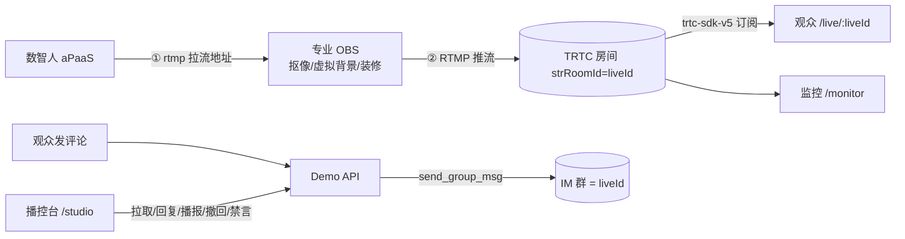

# 数字人直播全链路 · 架构与决策（第一性原理）

本文档记录当前生产标准架构的问题定义、数据权威与关键决策，便于迭代时对照，避免「补丁式堆功能」。

---

## 一、第一性原理

| 原则 | 在本项目的落地 |
|------|----------------|
| 动机先于手段 | 先固定「观众看什么、谁推流、后台管什么、数智人插在哪」四条边界，再选 API |
| 最短路径 | 复用官方能力（aPaaS rtmp 流、TRTC RTMP 入流、IM REST），不自研媒体服务器 |
| 根因而非补丁 | 房间元数据以服务端为权威；评论以 IM 群为权威（保留 MsgSeq）；视频流以 TRTC 房间为权威 |
| 决策可辩护 | 每个取舍用一两句话说明理由 |

---

## 二、问题定义

按**生产标准**打通：数智人云渲染 → 专业 OBS（抠像/虚拟背景/装修）→ TRTC 直播间 → 真实观众；评论真走 IM，可模型回复→编辑→播报，可撤回/禁言；支持多管理员协作；面向政策宣讲场景，内置演示种子评论。

非目标（首期不做）：服务端自建媒体处理（抠像/装修交给用户的专业 OBS）；多租户隔离/计费。

---

## 三、架构与数据权威

- **房间元数据**（liveId、标题、状态）：服务端 `server/data/rooms.json` 为权威。
- **视频流**：TRTC 房间为权威；生产模式由 OBS 推入，直连模式由数智人推入。
- **评论**：IM 群为权威；服务端镜像保存并记录 `MsgSeq` 以支持撤回。
- **数智人会话**：aPaaS 为权威；服务端内存维护房间→会话映射。
- **进房凭证（UserSig）**：服务端签发，密钥不落浏览器。

重启后是否成立：观众刷新重新进房；管理台从 `rooms.json` 恢复；数智人会话内存映射若丢，下次 start 重新建立。

---

## 四、关键决策（可辩护）

1. **生产模式走「数智人 rtmp 流 → OBS 拉流转推」**：与真人直播的 OBS 工作流一致，抠像/虚拟背景/装修交给成熟的 OBS，服务端不背媒体处理负担。保留 `direct` 模式（数智人直接进房）用于无 OBS 的快速验证。
2. **观众端用原生 `trtc-sdk-v5` 订阅任意远端视频，而非 TUILiveKit `LiveView`**：`LiveView` 只渲染 anchor 流，而 OBS/数智人都不是经 `startLive` 的 anchor；原生订阅与「谁是 anchor」解耦。
3. **评论真走 IM、撤回/禁言用 IM REST**：评论以 IM 群为单一权威，撤回/禁言对真实消息生效；服务端代发保留 `MsgSeq`。
4. **多管理员用带 `mod=a|b` 的分享链接 + 服务端认领锁**：可信人员无需口令，认领锁避免并发重复回复。
5. **房间号用字符串 `liveId`**：天然满足 TRTC RTMP 入流（≤64、数字/字母/下划线）与 IM 群 ID 对齐，无需引入数字房间号模型。

---

## 五、代码入口速查

| 模块 | 路径 |
|------|------|
| 数智人 aPaaS（trtc/rtmp 会话、驱动） | `server/ivhApaas.mjs` / `server/ivhPipeline.mjs` |
| OBS RTMP 推流地址生成 | `server/trtcRtmp.mjs` |
| IM 评论链路（发/撤回/禁言） | `server/imRest.mjs` |
| 播控 API（开播/评论/播报/撤回/禁言/认领/种子） | `server/studio.mjs` |
| 房间 CRUD / token / 健康检查 | `server/index.mjs` |
| 管理台 / 播控台 / 观众端 / 监控 | `playground/src/views/*.vue` |
| 原生 TRTC 订阅 | `playground/src/utils/useTrtcStage.js` |

---

## 六、待真机验证项（需真实密钥/OBS）

- 数智人 `rtmp` 会话 `PlayStreamAddr` 与 FLV/HLS 拉流在 OBS 中的实际可用性。
- 数智人资产输出透明/绿幕背景，OBS 色度键抠像效果。
- TRTC「输入媒体流进房」开通后，RTMP 推流回房与观众端可见性。
- IM `send_group_msg` 返回 `MsgSeq`、`group_msg_recall` 撤回、`forbid_send_msg` 禁言的端到端联调。

*文档随 `main` 分支迭代更新。*
