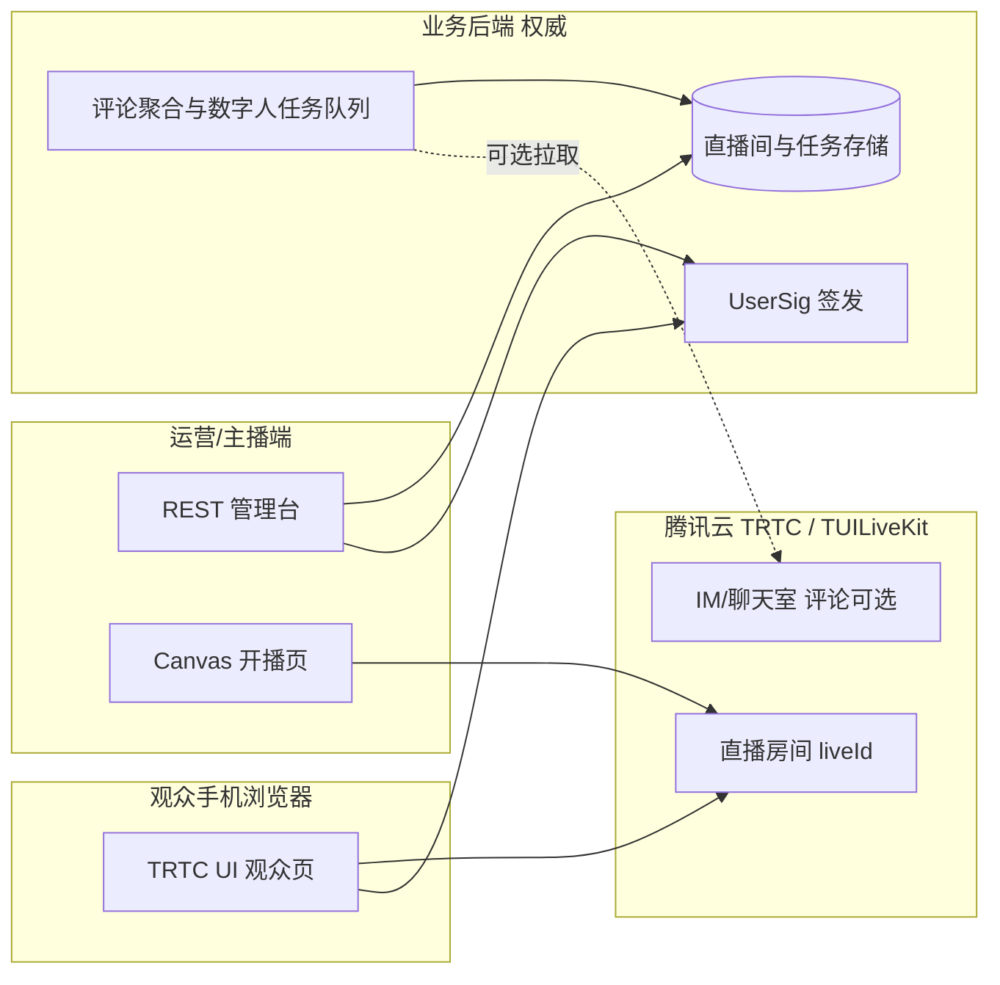

# 数字人直播全链路：优化方案（第一性原理）

本文档在动手写大量新代码之前，先把**问题定义、数据权威、可验证的最短路径**写清楚，便于后续迭代时对照，避免「补丁式堆功能」。

---

## 一、第一性原理（本仓库内的编码准则）

| 原则 | 含义 | 在本项目中的落地方式 |
|------|------|----------------------|
| **动机先于手段** | 目标或约束不清晰时，先对齐问题定义再写代码 | 先固定「观众看什么、主播推什么、后台管什么、数字人插在哪」四条边界，再选 TRTC / TUILiveKit API |
| **最短路径** | 目标明确时优先更短、更可验证的做法 | 能用一个静态页 + 少量 REST 验证的，不先上微服务；能用官方 UI 组件的，不自研播放器壳子 |
| **根因而非补丁** | 追到机制层面：数据在哪、谁权威、重启后是否成立 | 直播间列表、评论、数字人任务状态以**服务端持久化**为权威；浏览器仅缓存会话态；`liveId` / `userSig` 与腾讯云控制台的对应关系写进 README |
| **决策可辩护** | 重要取舍能用一两句话说明「为什么」 | 每个大章节末尾用 **取舍说明** 固定决策理由 |

---

## 二、问题定义（动机先于手段）

### 2.1 业务目标（要跑通的「全链路」）

1. **观众端（手机）**：进入指定直播间，使用 **TRTC / TUIKit 官方 UI（AtomicX）观众能力** 观看直播，体验接近真实业务。
2. **主播端 / 运营端**：通过 **RESTful 后台** 创建直播间；进入某房间后，用现有 Demo 已验证的方式 **Canvas 采集图像并开播**（与 `demo/minimal-live-broadcast.html` 同源思路）。
3. **历史 Demo 归档**：旧的一体化调试页（点赞参数 + 腾讯观众 JSON 面板等）仍可访问，不阻塞新主流程。
4. **数字人预留**：评论从直播间进入业务后台；运营 **挑选单条评论** → 大模型生成回复文案 → 调用公有云 **文生图 / 图生图** 服务 → 结果用于 **渲染到 Canvas 或替换视频源** 再推流（首期可只做「拉取 + 选中 + 占位任务」不接真实模型）。

### 2.2 非目标（首期刻意不做，避免范围爆炸）

- 不接全量评论自动应答（仅「选中才触发」）。
- 不承诺多租户隔离、计费、审核全链路（可在方案中预留接口字段）。
- 不把 `userSig` 长期硬编码在前端（生产必须由服务端签发；Demo 可用环境变量 + 短期密钥说明）。

### 2.3 当前仓库事实（基线）

| 模块 | 路径 | 现状 |
|------|------|------|
| 静态点赞 Demo | `demo/live-like-demo.html` | 与 Vue 组件行为对齐的纯 HTML 示例 |
| 点赞 + 腾讯观众调试（单页） | `playground/src/views/LegacyPlayground.vue` + `components/TencentLiveAudiencePanel.vue` | 路由 **`/legacy`**；观众侧仅拉房间 JSON，**不渲染视频** |
| Canvas 开播（静态 HTML） | `demo/minimal-live-broadcast.html`（Playground 内 **`/minimal-live-broadcast.html`** 同源挂载） | Canvas → 推流；支持 URL 查询参数预填 |
| 观众 TRTC UI | `playground/src/views/AudienceLive.vue` | 路由 **`/`**；`LiveView` + `login` / `joinLive`；底部 **BarrageList / BarrageInput**（IM 真实弹幕） |
| 管理台 / 数字人任务 API | `playground/src/views/AdminRooms.vue` + `server/index.mjs` | 路由 **`/admin`**；REST 见 README |
| 数智人 aPaaS（可选） | `server/ivhApaas.mjs`、`server/ivhPipeline.mjs` | 配置 `IVH_*` 后对接 `gw.tvs.qq.com`；未配置则任务仍为占位图 |
| 评论进数智人 | `POST .../digital-human/comment-presubmit` + `jobs` | 服务端暂存权威文本；可选 `DH_JOB_REQUIRE_TICKET=1` |
| 主播控制台 / Canvas 遗留 | `playground/src/views/AnchorBroadcast.vue`、`playground/src/views/AnchorCanvasLegacy.vue` | **`/anchor/:id`** 主路径；**`/anchor-canvas/:id`** 仅 Canvas 调试 |
| 构建 | `vite.config.js`，root 为 `playground/` | 已接入 **Vue Router**；`/api` 开发期代理至 `127.0.0.1:3001` |

**根因结论**：「观众 UI」与「Canvas 开播」目前分属两条技术路径，全链路需要 **路由 + 可选轻后端** 把它们接成「创建房间 → 主播页推流 → 观众页拉 UI 观看」。

---

## 三、架构与数据权威（根因而非补丁）

### 3.1 逻辑角色与数据归属



- **直播间（liveId、标题、状态、创建时间）**：以业务后端为权威；前端列表来自 `GET /api/rooms`。
- **进房凭证（userSig）**：以服务端为权威（腾讯云密钥不落浏览器）。
- **评论**：若使用腾讯云 IM/聊天室，**消息 ID 与内容** 以云端为准；业务库仅存「哪条被选中做数字人」的 **任务记录**（`comment_id`、`room_id`、`status`、`reply_text`、`image_url` 等），避免与 IM 双写冲突。
- **数字人输出图像**：以对象存储 URL 或 CDN URL 为权威；Canvas 开播页只消费 URL（或短生命周期 base64，不推荐生产）。

### 3.2 重启后是否成立

- 观众刷新页面：重新 `login` + `joinLive`，房间仍在腾讯云侧；本地 `localStorage` 仅可作「上次看的 liveId」缓存，**不能**作为房间是否存在的唯一依据。
- 管理台刷新：列表从 `GET /api/rooms` 恢复；未完成任务从 DB 恢复。

---

## 四、分阶段实施方案（最短路径 + 可验证里程碑）

### 阶段 0：路由与「历史 Demo 归档」（需求 1）

**目标**：新主页与旧调试页隔离，旧代码可通过固定路径访问。

**建议做法**：

1. 引入 `vue-router`，入口仍在 `playground/src/main.js`。
2. 将当前 `App.vue` 整页内容迁移为 `playground/src/views/LegacyPlayground.vue`（或 `ArchiveLikeTrtcDebug.vue`），路由例如 `/legacy` 或 `/archive/playground`。
3. 根路径 `/` 预留给「观众主站」；在 `README.md` 中写明归档路径，避免同事误以为旧页是主产品。

**取舍说明**：用路由归档比重构目录或复制一份代码更短；单一 Vite 应用便于统一部署。

**验证**：访问 `/legacy` 与改造前行为一致（点赞调试 + 腾讯面板）。

---

### 阶段 1：主页面 = TRTC UI 观众端 + 移动优先（需求 2）

**目标**：手机打开默认进入观众端，使用官方 UI 能力看播。

**建议做法**：

1. 新建 `views/AudienceLive.vue`（或接入 `tuikit-atomicx-vue3` 文档中的 Live 观众 UI 容器组件，以官方当前版本为准）。
2. 路由 `/` 或 `/live/:liveId`：从 query 或 path 读取 `liveId`；`sdkAppId` / `userId` 可由环境变量或管理台生成的「观众测试链接」拼接。
3. `userSig`：**开发环境**可由本地小服务 `/api/usersig` 签发；生产必须走正式后端。
4. 样式：`viewport`、安全区、`max-width`、触控区域符合移动端 H5 规范。

**取舍说明**：优先接官方 UI，减少自研播放器与状态机；当前 `TencentLiveAudiencePanel` 仅 JSON 调试，保留在归档路由供研发对比 API。

**验证**：真机浏览器进入房间能看到画面与基础控件；断网重连后仍能进房。

---

### 阶段 2：RESTful 管理台 + 与 Canvas 开播打通（需求 3）

**目标**：后台可创建直播间；点击进入主播推流页，复用 `minimal-live-broadcast` 的 Canvas 开播方法。

**建议 API 草图（可微调，但保持 REST 资源思维）**：

| 方法 | 路径 | 说明 |
|------|------|------|
| `GET` | `/api/rooms` | 列表 |
| `POST` | `/api/rooms` | 创建 `{ title?, live_id_strategy? }`；服务端生成或与腾讯云对齐 `liveId` |
| `GET` | `/api/rooms/:id` | 详情（含推流侧需要的字段摘要） |
| `POST` | `/api/rooms/:id/token` | 为主播/观众签发短期 `userSig`（分角色） |

**前端**：

- `views/AdminRooms.vue`：列表 + 创建表单。
- `views/AnchorBroadcast.vue`：内嵌或迁移 `minimal-live-broadcast` 逻辑（建议逐步把脚本抽成 `examples/minimalLiveBroadcast.js` 供 HTML 与 Vue 共用，避免双份逻辑漂移）。

**取舍说明**：首期 SQLite / JSON 文件存储即可验证流程；确认跑通后再换 PostgreSQL。

**验证**：创建房间 → 主播页开播 → 观众页同一 `liveId` 可见画面。

---

### 阶段 3：数字人接口预留（需求 4）

**目标**：后台能拉取评论列表；运营选中一条后触发「大模型回复 + 云生图」管线；其余评论忽略。

**建议 API**：

| 方法 | 路径 | 说明 |
|------|------|------|
| `GET` | `/api/rooms/:id/comments?cursor=` | 拉取评论分页（首期可用 Mock 或腾讯云 IM 拉历史） |
| `POST` | `/api/rooms/:id/digital-human/jobs` | body: `{ comment_id, comment_text }` → 创建异步任务 |
| `GET` | `/api/rooms/:id/digital-human/jobs/:jobId` | 查询 `pending \| llm_done \| image_done \| failed` |
| `POST` | 内部或 Webhook | LLM / 生图完成后回调更新任务 |

**前端**：

- 管理台增加「评论 inbox」与「选中并生成」按钮；展示任务状态。
- 主播页订阅任务完成事件（轮询或 SSE）：将返回的 `image_url` 绘制到 Canvas 下一帧或切换贴图。

**取舍说明**：首期 **不接真实大模型**，用固定占位文案 + 占位图 URL 跑通状态机，避免同时调试三家云 API。

**验证**：选中一条 → 任务状态流转 → Canvas 上出现占位图（或网络图）。

---

## 五、关键技术风险与根因级对策

| 风险 | 根因 | 对策 |
|------|------|------|
| CORS 与凭证 | 浏览器直连多个域名 | 所有敏感调用经同源后端代理 |
| `userSig` 泄露 | 前端长期持有密钥 | 短期 token + 最小权限角色（观众/主播分离） |
| Canvas 帧率与 CPU | 软编码推流占主线程 | 限制分辨率帧率；数字人图「贴图替换」优于每帧全图重绘 |
| 评论来源不统一 | IM 与自定义弹幕混用 | 在数据模型里明确 `source` 字段，查询层适配 |

---

## 六、目录结构演进建议（可选）

保持「最短路径」前提下，仅当文件变大时再拆：

```text
playground/src/
  views/
    AudienceLive.vue      # 主站观众
    AdminRooms.vue        # 管理台
    AnchorBroadcast.vue   # Canvas 开播
    LegacyPlayground.vue  # 归档
  router/
    index.js
server/                     # 若引入 Node 后端
  index.js
  routes/rooms.js
  services/trtcUserSig.js
```

---

## 七、决策摘要（可辩护的一两句话）

1. **归档用路由而非复制仓库**：同一构建产物、最少重复代码，历史行为可回归验证。
2. **观众用官方 UI、主播保留 Canvas Demo**：观众体验依赖成熟组件；主播侧已验证的 Canvas 推流路径改动风险低。
3. **评论数字人走「选中任务」而非全自动**：降低误触发与合规风险，状态机简单可测。
4. **首期后端可极简**：REST + 内存或 SQLite 即可证明「创建 → 推流 → 观看 → 选评论任务」闭环，再替换存储与真实 AI。

---

## 八、下一步执行清单（建议顺序）

1. [x] 安装并配置 `vue-router`，迁移当前 `App.vue` 至归档路由。
2. [x] 新建观众页，接入官方 TRTC UI（与现有 `tuikit-atomicx-vue3` 版本对齐）。
3. [x] 增加最小 Node（或现有栈）服务实现 `POST/GET /api/rooms` 与 `userSig`。
4. [x] 迁移 `minimal-live-broadcast.html` 核心逻辑到 Vue 主播页，参数从「管理台跳转」带入。
5. [x] 增加评论拉取与数字人任务 API（Mock → 真实 IM → 真实 LLM/生图）。
6. [x] 服务端对接数智人云渲染 HTTP（`ivhApaas` + `ivhPipeline`）；任务记录 `ivhSessionId` 等字段；详见 `docs/trtc-ivh-integration.md`。
7. [x] **根因修正**：主播/观众页改用原生 `trtc-sdk-v5` 直接 `enterRoom` + 监听 `REMOTE_VIDEO_AVAILABLE`，不再依赖 TUILiveKit 的 `startLive`/`LiveView`（后者只会渲染「直播 anchor」那一路视频，数字人作为同房间另一用户的画面会被忽略——这是「能听见声音、看不到画面」的根因）。

---

## 九、根因复盘：数字人直播一直没有测试成功 → 现已修正

### 9.1 现象

- 旧主播页：以主播身份 `startLive` → 「发起数字人任务」 → 服务端 aPaaS `createsession(TrtcStrRoomId=liveId)` → 听得到声音。
- 管理台 / 观众端 `LiveView` 看不到数字人的画面。

### 9.2 根因（数据在哪、谁权威）

- TRTC 房间内的**音频**默认自动混音 → 所有同房间用户互相听得到。
- TRTC 房间内的**视频**需要订阅者显式 `startRemoteVideo({ userId })`。
- TUILiveKit `LiveView` 内部只订阅并渲染**该 live 的 anchor**（即调用 `startLive` 的那个用户）发布的主流；数字人是由 aPaaS 以另一名 TRTC 用户进入同一房间推流，对 `LiveView` 而言不是 anchor，**故不会被渲染**。
- 这意味着「数字人能不能被看到」与「TUILiveKit 是否认为他是 anchor」直接绑定——而我们无法让服务端 aPaaS 反过来调 TUILiveKit 的 `startLive`。

### 9.3 决策（最短路径）

- 主播 / 观众页**绕过** `LiveView`，改用原生 `trtc-sdk-v5`：进同一 `strRoomId`（=业务 `liveId`），监听 `REMOTE_VIDEO_AVAILABLE`，对任意推流者执行 `startRemoteVideo`。
- 服务端新增：`POST /api/rooms/:id/dh/start`（启动数字人 = manual-job 等价封装）、`POST /api/rooms/:id/dh/stop` 与 `POST .../digital-human/stop-session`（主动 `closesession` 释放并发；下一次 start 仍会自动先关上一会话）。主播页调用 `manual-job` / `stop-session` 以避免 preview 场景下短路径未命中代理时的 404。
- 主播页变成「两键最小 demo」：① 主播开播（仅进 TRTC 房间监看），② 发起数字人测试。观众页只需 liveId / SDKAppID / userId 即可看到同一房间内数字人的画面。

### 9.4 决策可辩护

- 数据权威没有变：TRTC 房间仍是视频流权威，aPaaS 仍是数字人会话权威，`rooms.json` 仍是房间元数据权威；只是**前端订阅策略**从「让 TUILiveKit 选谁是 anchor」改为「订阅任意远端推流者」。
- 重启后是否成立：浏览器刷新仍然能恢复（重新签 UserSig + 进房）；服务端 `lastOpenIvhSessionByRoomInternalId` 内存里若丢，最坏只是下次 start 时不会先关上一会话——aPaaS 侧靠 `closesession` 释放并发即可。

*文档版本：与仓库 `main` 分支同步迭代；修改本文件时请同步更新「当前仓库事实」一节中的路径与行为描述。*
